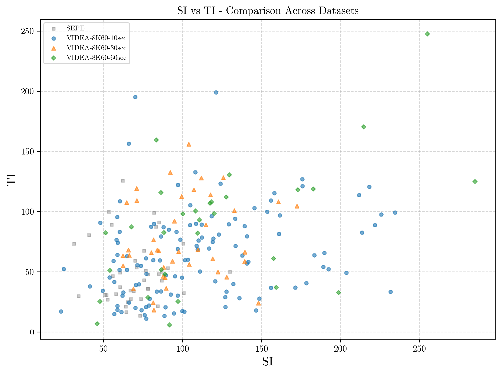
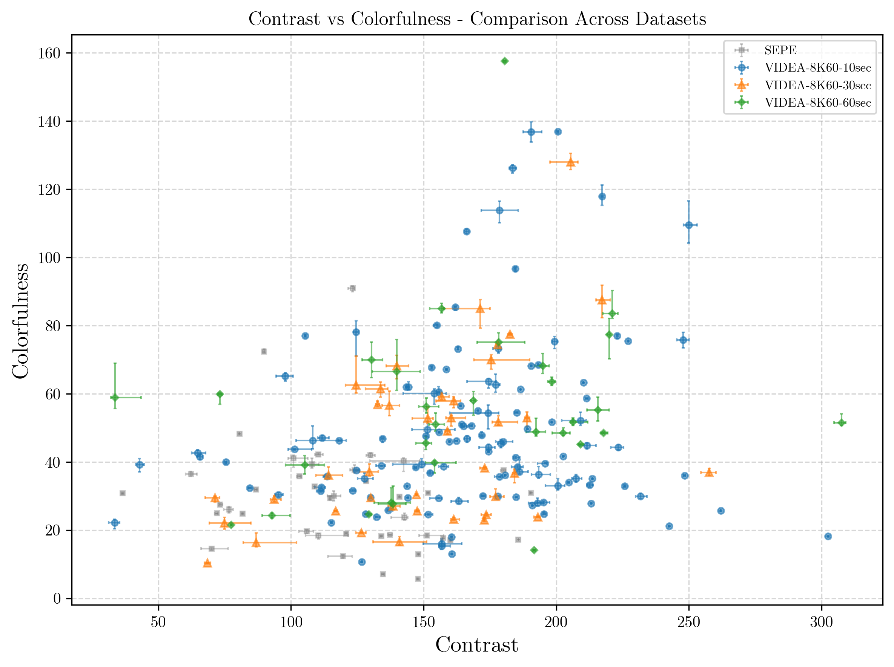
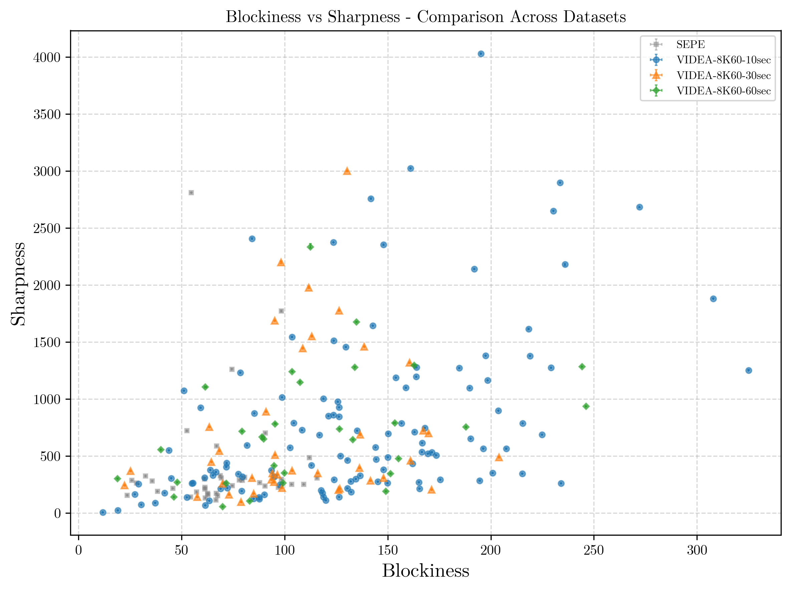

<a id="idtext"></a> 
# VIDEA-8K-60FPS Dataset
Please feel free to [**view and download the dataset here**](https://drive.google.com/drive/folders/16xZO2dQf8BpmZw1xaM70S-LXxdNCcVHm?usp=sharing) \
For comments, feedback, or question please [Contact Us](mailto:Tariq.AlShoura@ucalgary.ca?subject=Inquiry%20about%20the%20SEPE%208K%20Dataset) at: [Tariq.AlShoura@ucalgary.ca](mailto:Tariq.AlShoura@ucalgary.ca?subject=Inquiry%20about%20the%20SEPE%208K%20Dataset)


<!-- > [!NOTE]
> Due to daily upload limitations of Google Drive and the dataset's total size (> 13 TB), some content is still being uploaded. \
> Current upload progress 96.32%, expected completion date is Wednesday, June 11, 2025.
> Remaining items (videos 23_60_8K.mp4 -> 29_60_8K.mp4) -->

**Please cite the following paper if using the dataset:**
> Tariq Al Shoura, Ali Mollaahmadi Dehaghi, Reza Razavi, and Mohammad Moshirpour. 2025. VIDEA-8K-60FPS Dataset: 8K 60FPS Video Sequences for Analysis and Development. In Proceedings of the 33rd ACM International Conference on Multimedia (MM ’25), October 27–31, 2025, Dublin, Ireland.
ACM, New York, NY, USA, 7 pages. https://doi.org/10.1145/3746027.3758278

## Table of Contents
- [Dataset Overview](#dataset-overview)
   * [Videos Samples Preview](#videos-samples-preview)
- [Dataset Gathering and Generation](#dataset-gathering-and-generation)
   * [Encoding Quality](#encoding-quality)
- [Dataset Characteristics ](#dataset-characteristics)
   * [Spatial and Temporal Perceptual Information Distribution of the Dataset's Videos.](#spatial-and-temporal-perceptual-information-distribution-of-the-datasets-videos)
   * [Average Motion Distribution of the Dataset's Videos.](#average-motion-distribution-of-the-datasets-videos)
   * [Contrast and Colorfulness Distribution of the Dataset's Videos.](#contrast-and-colorfulness-distribution-of-the-datasets-videos)
   * [Blockiness and Sharpness Distribution of the Dataset's Videos.](#blockiness-and-sharpness-distribution-of-the-datasets-videos)
   * [Samples of the Dataset Histogram](#samples-of-the-dataset-histogram)
- [Dataset Split](#dataset-split)
   * [Output File](#output-file)
   * [CSV Format](#csv-format)
   * [Required Libraries](#required-libraries)


<br><br>


___
## Dataset Overview
The dataset consists of:
- 120 clips of 10 seconds (600 frames)&nbsp;&nbsp;&nbsp;(~4.11 TB)
- &nbsp;&nbsp;40 clips of 30 seconds (1800 frames)&nbsp;(~4.15 TB)
- &nbsp;&nbsp;30 clips of 60 seconds (3600 frames)&nbsp;(~5.77 TB)


<br>
The main dataset directory is broken down as:

<pre>
8K60FPS  --  <i>main directory accessed through <a href="https://drive.google.com/drive/folders/16xZO2dQf8BpmZw1xaM70S-LXxdNCcVHm">here</a></i>
|
│
└───10sec  --  <i>contains the 10s videos subset <a href="https://drive.google.com/drive/folders/1QiggOsBF7lcFUIcQ3eBq3OuXVvM9xrbW">here</a></i>
│   │
│   └───Analysis  --  <i>Per-frame metric outputs <a href="https://drive.google.com/drive/folders/1XwcdjBjEWPELX_rw3XXrnZgFqemSZfoI">here</a></i>
│   |   │
|   |   └───encoding_quality  -- <i>encoding quality evalutation of 10s 8K 60fps video files</i>
|   |   |   |
│   |   │   |   000_10sec_8K_enc_qual.csv   
│   |   │   |   001_10sec_8K_enc_qual.csv
│   |   │   |   ...
│   |   │
|   |   └───histograms  -- <i>histogram and hue analysis of 10s 8K 60fps video files</i>
|   |   |   |
│   |   │   |   000_10sec_8K_vid_cmplx.csv
│   |   │   |   000_10sec_8K_vmaf.csv
│   |   │   |   ...
│   |   │
|   |   └───vido_complixity  -- <i>pre-frame complexity analysis of 10s 8K 60fps video files</i>
|   |   |   |
│   |   │   |   000_10sec_8K_vmaf.csv
│   |   │   |   001_10sec_8K_vmaf.csv
│   |   │   |   ...
│   |
│   └───Samples  --  <i>4K mid-quality frames extracted for quick viewing <a href="https://drive.google.com/drive/folders/1h517WOmdaxneH3WlYsstz3urgPDYCTfP">here</a></i>
│   |   │   
│   |   │   000_10s_4K_sample.mp4
│   |   │   001_10s_4K_sample.mp4
│   |   │   ...
│   |
│   └───Videos  --  <i>Raw 10s 8K 60fps video files <a href="https://drive.google.com/drive/folders/1KsOeqv2TBaPmv3TzG1RnNhvVarDAD6kN">here</a></i>
│       │   
│       │   000_10s_8K.mp4
│       │   001_10s_8K.mp4
│       │   ...
│
└───30sec  --  <i>contains the 30s videos subset <a href="https://drive.google.com/drive/folders/1gBer9UJ50EDuCIsdWcLx7xOKpe4KlVEd">here</a></i>
│   │
│   └───Analysis  --  <i>Per-frame metric outputs <a href="https://drive.google.com/drive/folders/1hoz6c_x0l1PIMOtcmAcWAcBK82i_Ff-f">here</a></i>
│   |   │   
│   |   │   ...
│   |
│   └───Samples  --  <i>4K mid-quality frames extracted for quick viewing <a href="https://drive.google.com/drive/folders/1WReHyOFdB9hFoeAKn8RHwXjRCRxmFy3W">here</a></i>
│   |   │   
│   |   │   ...
│   |
│   └───Videos  --  <i>Raw 30s 8K 60fps video files <a href="https://drive.google.com/drive/folders/1AW0Rk4vpH7KIYIqAcjevBUuA6AF9TSvm">here</a></i>
│       |
│       |   ...
│
└───60sec  --  <i>contains the 60s videos subset <a href="https://drive.google.com/drive/folders/16ad5VuLKvkQxpM5QpWAf8WPlBRLptt3p">here</a></i>
    │
    └───Analysis  --  <i>Per-frame metric outputs <a href="https://drive.google.com/drive/folders/1BapYlETMXuxh_qJICw7Drc0SwGeMHe18">here</a></i>
    |   │   
    |   │   ...
    │
    └───Samples  --  <i>4K mid-quality frames extracted for quick viewing <a href="https://drive.google.com/drive/folders/1ZvdrjsOs_YD0sELpUXeTSGrSc_8MbARz">here</a></i>
    |   │   
    |   │   ...
    │
    └───Videos  --  <i>Raw 60s 8K 60fps video files <a href="https://drive.google.com/drive/folders/14r6-jHfDXo4bXjmDYR9mYvrKNg9tfeKI">here</a></i>
        |
        |   ...
</pre>

<br>

### Videos Samples Preview
A snapshot from the first frame of each video is available [here](previews/).
<p float="left">

  
   
  
  
  
  
  
  
  
  
  

  
  
  
  
  

  
  
  
  
  

  
  
  
  
  

</p>

[Back to Top](#idtext)
___
<br><br>

## Dataset Gathering and Generation

The dataset was collected using Nikon Z8 camera with a resolution of 8256 × 4644 at a frame rate of 59.9. The raw footage was captured in 12-bit Nikon N-RAW (NEV) format using BT.2020 color gamut.
Then DaVinci Resolve 19 was used to: 
- a one-time transform from BT.2020/N-Log to DCI-P3/Gamma 2.4 for editability
- cut the videos to uniform lengths and
- crop the videos from the center to a more standard resolution of to 8K DCI (8192 × 4320)
- apply a slight noise filtering in some loww-light cases

The video sequences were exported as 16-bit RGBA lossless PNGs, then FFmpeg with the hardware acceleration library provided by NVIDIA is used to encode the videos using the following command

```bash
ffmpeg -hwaccel cuda -hwaccel_output_format cuda \
    -framerate 60000/1001 -i ".\${seq_id}\%08d.png" \
    -pix_fmt yuv444p16le -c:v hevc_nvenc \
    -tune lossless -profile:v main10 -multipass 2 \
    -bf 4 -b_ref_mode 1 -nonref_p 1 -rc-lookahead 16 \
    ".\${output_file_name}.mp4"
```
[Back to Top](#idtext)

<br>


### Encoding Quality

<p float="left">

  
   
  
  

</p>

*__Figure 5.__ Quality of Encoded Videos Compared to the Source PNGs*

[Back to Top](#idtext)
___
<br><br>

## Dataset Characteristics 

### Spatial and Temporal Perceptual Information Distribution of the Dataset's Videos.


*__Figure 1.__ Spatial and Temporal Information Distribution of the proposed dataset compared to the [SEPE Dataset](https://github.com/talshoura/SEPE-8K-Dataset)*

[Back to Top](#idtext)
___
<br>

### Average Motion Distribution of the Dataset's Videos.


*__Figure 2.__ Average Motion Distribution Distribution of the proposed dataset compared to the [SEPE Dataset](https://github.com/talshoura/SEPE-8K-Dataset)*

[Back to Top](#idtext)
___
<br>

### Contrast and Colorfulness Distribution of the Dataset's Videos.


*__Figure 3.__ Spatial and Temporal Information Distribution of the proposed dataset compared to the [SEPE Dataset](https://github.com/talshoura/SEPE-8K-Dataset)*

[Back to Top](#idtext)
___
<br>

### Blockiness and Sharpness Distribution of the Dataset's Videos.


*__Figure 4.__ Spatial and Temporal Information Distribution of the proposed dataset compared to the [SEPE Dataset](https://github.com/talshoura/SEPE-8K-Dataset)*

[Back to Top](#idtext)
___
<br>


### Samples of the Dataset Histogram
The full list of the histograms is available [here](histograms/) as images and in the database as csv files
<p float="left">

  
  

  
  

  
  

  
  

  
  

  
  

</p>

*__Figure 5.__ Sample of Histograms and Hue Satuaration across Videos*

[Back to Top](#idtext)
___
<br>

## Dataset Split

To ensure a fair and cluster-representative train/test division, videos were clustered using **Agglomerative Clustering** based on statistical features (e.g., mean, skewness, kurtosis, etc.). The resulting clusters were used to **stratify** the data before splitting.

- **Clustering algorithm**: `AgglomerativeClustering (n_clusters=12)`
- **Stratified by**: Cluster labels
- **Split ratio**: `80%` train / `20%` test
- **Random seed**: `0` (for reproducibility)

### Output File
The mapping of each video to its dataset split is stored in:


### CSV Format

| Column         | Description                           |
|----------------|---------------------------------------|
| `video_number` | Unique name/ID of the video           |
| `cluster`      | Cluster ID based on UMAP              |
| `split`        | One of `train` or `test`              |


**Example:**
```csv
video_number,cluster,split
001_10s,2,train
002_10s,6,test
003_10s,3,train
```


### Required Libraries

The following Python packages are required to run the clustering and dataset splitting pipeline:

```bash
pip install pandas scikit-learn umap-learn matplotlib
```

Please refer to [train_test_split/](train_test_split/) for the code and csv files.

[Back to Top](#idtext)
___
<br>


